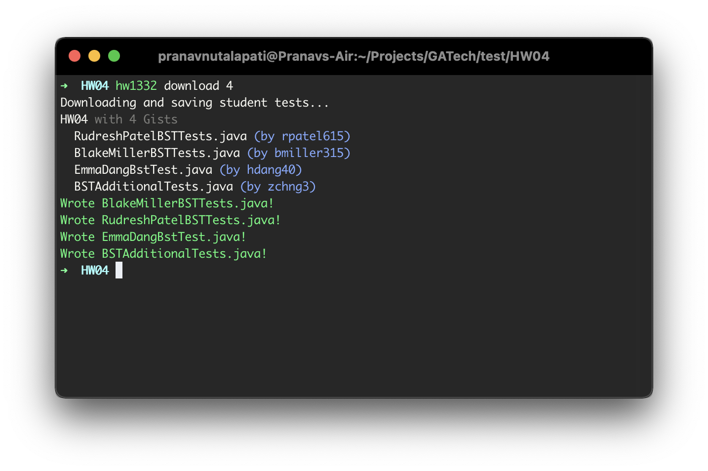

<p align="center">
  
</p>

# HW1332 Downloader

Welcome to the epitome of laziness. We've all been there before. You want to test your homework but don't want to go *all the way* to Piazza and download *4 SEPARATE FILES*. Well now, you don't have to!

## Installation
1. Head over to [Releases](https://github.com/preyneyv/hw1332-client/releases/latest) and download the correct version for your OS. If you'd prefer to build it yourself, keep scrolling.
2. Put it somewhere in your `PATH`. 
   - macOS: https://coolestguidesontheplanet.com/add--path-osx/
   - Linux: https://opensource.com/article/17/6/set-path-linux
   - Windows: https://www.architectryan.com/2018/03/17/add-to-the-path-on-windows-10/
3. You're ready to start saving marginal amounts of time!

## Usage

```
$ hw1332 help
The epitome of laziness. An automated way to download CS 1332 Student Tests.
Built by @preyneyv in March 2021.

Usage: hw1332 <command> [arguments]

Global options:
-h, --help    Print this usage information.

Available commands:
  about      Why does this exist?
  download   Download the tests available for a homework.
  forget     Delete saved credentials.
  list       Show a list of available homework.
  view       See the tests available for a specific homework.

Run "hw1332 help <command>" for more information about a command.
```

## Examples
- List all available homework.
  ```
  $ hw1332 list
  ```
- View the tests available for HW04.
  ```
  $ hw1332 view 4
  ```
- Download tests for HW03.
  ```
  $ hw1332 download 3
  ```
## A Note about Two-Factor Authentication
Some of you may have two-factor authentication enabled, and honestly, good on you! But as you might imagine, it messes with the authentication process a bit.

~~So what you need to do is **turn it off**.~~ 

1. When prompted, attempt to authenticate normally. You will be greeted by this message:
  ```
  ✔ GATech GitHub Username ‥ pnutalapati3
  ✔ GATech GitHub Password ‥ ****************
  It appears you have 2FA enabled! Good on you! But that complicates things...
  Go to https://github.com/preyneyv/hw1332-client#a-note-about-two-factor-authentication for instructions.
  ```
  Hey look, that's recursion!

2. Go to https://github.gatech.edu/settings/tokens/new and create a new token.
  - Give the token a nickname like `HW1332 Token` or `muhnemjeff`.
  - You can leave all the scopes unticked. We prefer sorcery over permissions.
  - Copy the newly-generated token.
3. Return to the terminal and paste your token into the prompt.
  ```
  Using `pnutalapati3` as the username...
  ✔ GATech GitHub Token ‥ ****************************************
  That worked!
  ```
4. **Make sure you accept the "Remember these credentials?" prompt.** While this isn't technically necessary, you'd have to do this whole process every single time you run any command. This is *no bueno*.

## Building from Source
So you don't trust me. I get it. Or you're using a Samsung Smart Fridge, which is unfortunately not a supported OS. Regardless of your reasons, you want to compile it yourself.

The entrypoint for the application is `lib/boostrapper.dart`. You can run it through `dart run lib/bootstrapper.dart <command>`. Use any toolchain to compile dart into native, but there's really only one that I know of, `dart2native`.